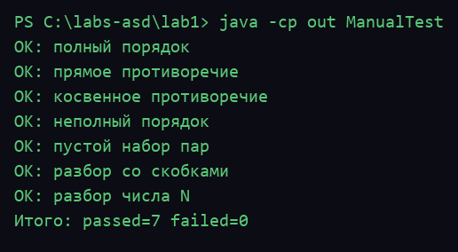
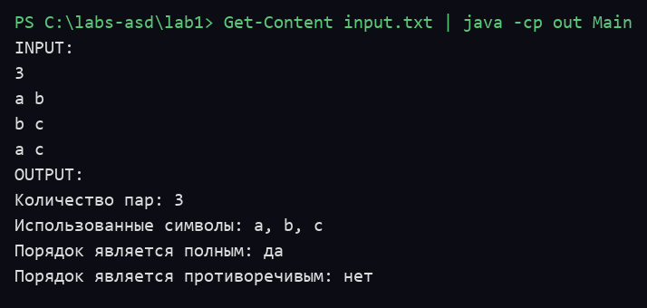

# Лабораторная работа №1

## Задача 1. Списки. Стеки. Очереди

Программа получает последовательность пар символов `(a, b)`. Пара означает, что символ `a` предшествует символу `b`.

Программа проверяет два свойства порядка:

- **полнота**, все использованные символы можно выстроить в цепочку `(A1, A2, ..., As)` в порядке предшествования;
- **противоречивость**, для некоторых символов `x, y` можно получить одновременно порядок `(x, y)` и `(y, x)`.

Для решения задачи пары представлены в виде ориентированного графа. Символы являются вершинами, а отношение предшествования представлено направленными дугами. Проверка выполняется обходом графа в глубину.

## Требования к реализации

- Язык Java без готовых коллекций JDK (`ArrayList`, `HashMap`, `HashSet`, `Stack` не используются).
- Все структуры написаны вручную: узел `ListNode`, список `StringList`, вершины `VertexNode`, список вершин `VertexList`, дуги `AdjNode`, стек `LinkedStack`.
- Разбор входных данных выполнен вручную, без регулярных выражений и математических функций.
- Требуется JDK 17 или новее, дополнительных библиотек не требуется.

## Запуск

Сначала нужно указать количество пар `N`, затем записать по одной паре в каждой следующей строке.

```text
3
a b
b c
a c
```

Допускается запись пар со скобками и запятой:

```text
3
(a, b)
(b, c)
(a, c)
```

Сборка и запуск из терминала:

```bash
javac -encoding UTF-8 -d out src/*.java
java -Dsun.stdout.encoding=UTF-8 -cp out Main < input.txt
```

Примечание: флаг `-encoding UTF-8` нужен, чтобы русские строки в исходниках компилировались
правильно, а `-Dsun.stdout.encoding=UTF-8` — чтобы русский вывод не превращался в `???` на Windows.
В PowerShell вместо `< input.txt` используется `Get-Content input.txt | java -Dsun.stdout.encoding=UTF-8 -cp out Main`.

Пример результата:

```text
Количество пар: 3
Использованные символы: a, b, c
Порядок является полным: да
Порядок является противоречивым: нет
```

## Проверка

Для проверки используются ручные тесты без готовых тестовых библиотек:

```bash
javac -encoding UTF-8 -d out src/*.java test/*.java
java -Dsun.stdout.encoding=UTF-8 -cp out ManualTest
```

## Скриншоты запуска

Ручные тесты (7/7):



Пример работы программы:



## Структура проекта

```text
src/Main.java, чтение входных данных и вывод результата
src/PrecedenceAnalyzer.java, построение графа и проверка порядка
src/VertexNode.java, вершина графа со списком смежности
src/VertexList.java, список вершин на односвязном списке
src/AdjNode.java, узел списка смежности
src/ListNode.java, узел односвязного списка
src/StringList.java, односвязный список строк
src/LinkedStack.java, стек на связном списке для поиска в глубину
test/ManualTest.java, ручные проверки основных случаев
```
