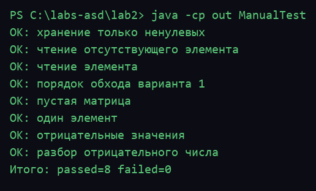
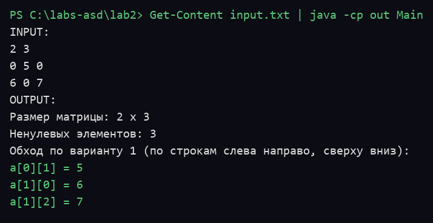

# Лабораторная работа №2

## Задача 1. Разреженные матрицы

Дана разреженная матрица в координатном формате (CS). Требуется обойти ее по варианту 1 и вывести все ненулевые элементы.

Вариант 1 обхода: по строкам слева направо, сверху вниз.

Координатный формат: хранятся только ненулевые элементы в виде троек (строка, столбец, значение) в односвязном списке.

## Требования к реализации

- Язык Java без готовых коллекций JDK (`ArrayList`, `HashMap`, `HashSet`, `LinkedList` не используются).
- Все структуры написаны вручную: узел `EntryNode`, матрица `SparseMatrixCS`, узел `ListNode`, список `StringList`, обход `MatrixWalker`.
- Разбор входных данных выполнен вручную, без регулярных выражений и математических функций.
- Требуется JDK 17 или новее, дополнительных библиотек не требуется.

## Запуск

Сначала указываются размеры матрицы `N M`, затем `N * M` целых чисел в любом разбиении на строки.

```text
2 3
0 5 0
6 0 7
```

Сборка и запуск из терминала:

```bash
javac -encoding UTF-8 -d out src/*.java
java -Dsun.stdout.encoding=UTF-8 -cp out Main < input.txt
```

Примечание: флаг `-encoding UTF-8` нужен, чтобы русские строки в исходниках компилировались
правильно, а `-Dsun.stdout.encoding=UTF-8` — чтобы русский вывод не превращался в `???` на Windows.
В PowerShell вместо `< input.txt` используется `Get-Content input.txt | java -Dsun.stdout.encoding=UTF-8 -cp out Main`.

Пример результата:

```text
Размер матрицы: 2 x 3
Ненулевых элементов: 3
Обход по варианту 1 (по строкам слева направо, сверху вниз):
a[0][1] = 5
a[1][0] = 6
a[1][2] = 7
```

## Проверка

Для проверки используются ручные тесты без готовых тестовых библиотек:

```bash
javac -encoding UTF-8 -d out src/*.java test/*.java
java -Dsun.stdout.encoding=UTF-8 -cp out ManualTest
```

## Скриншоты запуска

Ручные тесты (8/8):



Пример работы программы:



## Структура проекта

```text
src/Main.java, чтение входных данных и вывод результата
src/SparseMatrixCS.java, матрица в координатном формате CS
src/EntryNode.java, узел координатного списка (строка, столбец, значение)
src/MatrixWalker.java, обход матрицы по варианту 1
src/ListNode.java, узел односвязного списка
src/StringList.java, односвязный список строк для результата
test/ManualTest.java, ручные проверки основных случаев
```
